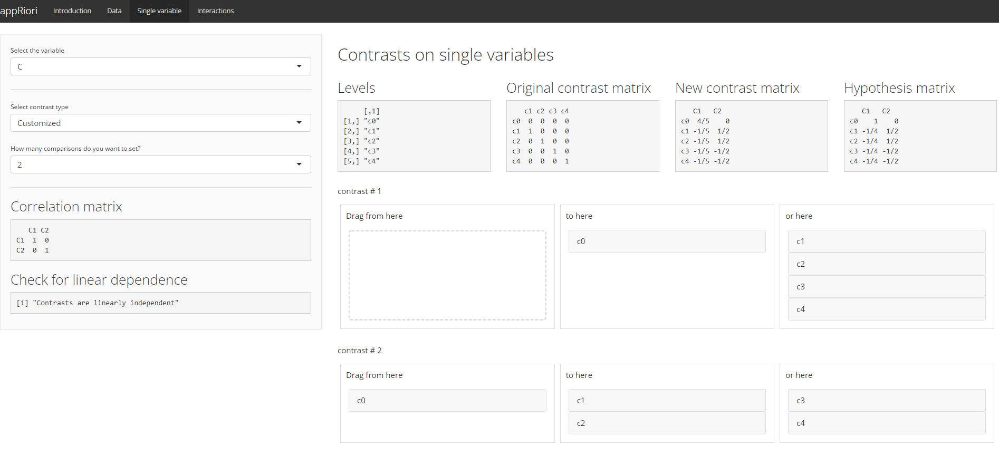
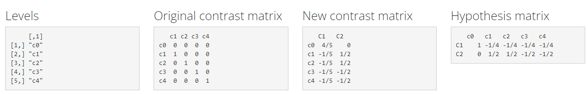
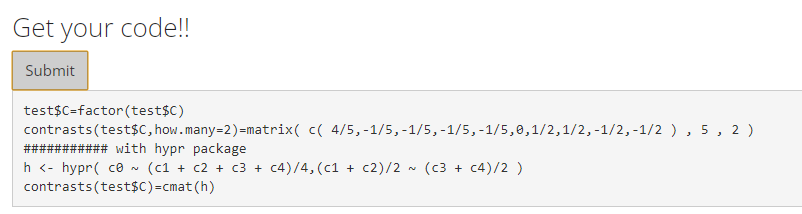

# How many contrasts?


In R, the contrast matrix of a specific variable can be observed by using the `contrasts()` function.

Moreover, it is possible to create or assign a contrast matrix to each variable by using the ``contrasts.'' family of functions. The following paragraphs will describe the kind of contrasts that can be generated in R and how can they be interpreted.

## Dummy contrasts


```r
contr.treatment(4)
```

```
##   2 3 4
## 1 0 0 0
## 2 1 0 0
## 3 0 1 0
## 4 0 0 1
```


Assumed $n$ levels of a categorical variable, in case of dummy contrasts (or treatment contrasts), the aim is to compare $n-1$ levels to a level chosen as reference or baseline. 

In R, the contrast matrix for dummy contrasts is `contr.treatment()`, setting as argument the number of levels of the variable of interest. In this case, $n = 4$.

NB: in R, the reference level is automatically assigned to the first level in alphabetical order. In case of levels coded with alphanumerical string, the reference will be the one containing the lowest number.

## Sum contrasts


```r
contr.sum(3)
```

```
##   [,1] [,2]
## 1    1    0
## 2    0    1
## 3   -1   -1
```


In sum (or deviation) contrasts, the aim is to compare the $n-1$ levels with the overall mean of those levels. 

If $n=2$, we are testing half of the difference among between levels. If $n>2$, we are testing half of the difference among one level with the overall mean that will be represented by the last level of our variable.

In R, the overall mean will be assigned always to the last level in alphabetical order, coded as $\textbf{-1}$. In case of levels coded with alphanumerical string, the reference will be the one containing the highest number. The level to be compared is coded with $\textbf{1}$ and the others with $\textbf{0}$. In R, the contrast matrix for sum contrasts is `contr.sum()`, setting as argument the number of levels of the variable of interest.

## Scaled sum contrasts


```r
contr.sum(3)/3
```

```
##         [,1]       [,2]
## 1  0.3333333  0.0000000
## 2  0.0000000  0.3333333
## 3 -0.3333333 -0.3333333
```

In scaled sum contrasts, the aim is similar to sum contrast. The difference is that in case of scaled sum contrast, we test the entire difference among levels (not the half one). In R, the contrast matrix for scaled sum contrasts is `contr.sum()`, setting as argument the number of levels of the variable of interest and dividing the function by the same number.

Formal note: Dividing a contrast by the number of factor level is an operation also called $\textbf{centering the contrasts}$. 

Centering is an advantageous choices especially when coding a priori hypothesis on interactions. Centering contrasts, in fact, enhances orthogonality of contrasts (Schad et al., 2020). 

It is possible to center all the type of contrasts in R. With appRiori, the Customized contrasts are centered by default!

## Repeated contrasts


```r
MASS::contr.sdif(3)
```

```
##          2-1        3-2
## 1 -0.6666667 -0.3333333
## 2  0.3333333 -0.3333333
## 3  0.3333333  0.6666667
```


In repeated contrasts (known also as successive difference contrasts or sliding difference contrasts or simple difference contrasts), the aim is to compare the neighbor levels of a variable. For instance, if we have a variable with three levels, the contrasts will be: $\textbf{2 vs 1}$, $\textbf{3 vs 2}$. 

For each comparison, the first element will be coded with a negative value, and the other(s) with a positive one. In R, the contrast matrix for repeated contrasts is `contr.sdiff()` of the ``MASS` package, setting as argument the number of levels of the variable of interest.

## Polynomial contrasts


```r
contr.poly(3)
```

```
##                 .L         .Q
## [1,] -7.071068e-01  0.4082483
## [2,] -7.850462e-17 -0.8164966
## [3,]  7.071068e-01  0.4082483
```


Polynomial contrasts (or orthogonal polynomial contrasts) are useful to test possible trends of the variable’s levels (i.e., linear, quadratic, cubic etc.). In R, the contrast matrix for polynomial contrasts is `contr.poly()`, setting as argument the number of levels of the variable of interest.

## Helmert contrasts


```r
contr.helmert(3)
```

```
##   [,1] [,2]
## 1   -1   -1
## 2    1   -1
## 3    0    2
```


Helmert contrasts are very useful for variables with $n>2$. Assuming $n=3$, the first contrast will encode the difference between the first two levels. The second contrast will encode the difference between the third level to the average of the first two conditions. 

In R, the contrast matrix for helmert contrasts is `contr.helmert()`, setting as argument the number of levels of the variable of interest.

# What's new in appRiori?

With appRiori, it is possible to use also further types of contrasts:

* Inverse helmert contrasts
* Customized contrasts: Set your customized contrasts by using a drag-and-drop menu.


## Reverse helmert contrasts


```
##      [,1] [,2]
## [1,]    2    0
## [2,]   -1    1
## [3,]   -1   -1
```


These contrasts consist in the reversed version of the Helmert contrasts. The can be very useful for variables with $n>2$. Assuming $n=3$, the first contrast will encode the difference between the first level with the average of the last two conditions. The second contrast will encode the difference between the last two levels.

# Customized contrasts

In appRiori, you contrast by using a dran-and-drop menu. 

Suppose, for instance, that we have a variable called "C", composed by five categories (i.e., c0, c1, c2, c3, c4). Assume now that c0 corresponds to a neutral condition. We could be interested in planning __a priori__ two comparisons:

* The condition c0 against all the others taken together (i.e., c0 $\textit{vs}$ (c1+c2+c3+c4))
* Excluding c0, the former two conditions with the latter two (i.e., (c1+c2) $\textit{vs}$ (c3+c4))

This can be done in appRiori following these steps:

1. Select the variable from the dropdown menu in the top-left corner of the Panel ("C" variable in this example).
2. Select "Customized" from the "Select contrast type" menu.
3. Select the number of contrasts to set from the "How many contrasts do you want to set?" menu ($\textbf{2}$ in this example)

<center>

</center>

4. Based on the decision made on point 3, a number of drag-and-drop menus will appear. In this case, two.
5. Drag the first condition(s) from the first block to the second one. Then, drag the other condition(s) from the first block to the third one. If you are not interested in one or more conditions, leave them within the first block.
6. Repeat this procedure for all the drag-and-drop menus.

After the last comparison has been set, it is possible to observe the default contrast matrix made by R, the new contrast matrix and the corresponding hypothesis matrix. In our example:

<center>

</center>

The code corresponding to this procedure is.

<center>

</center>

Up to now, appRiori is programmed to set contrast based on default contrasts and the drag and drop menu. For other fancy ways to customize the..stay tuned!!

In the next panels,two examples are provided, aimed at explaining how to (1) plan the contrasts, (2) use them into a regression model and (3) interpret the results!
