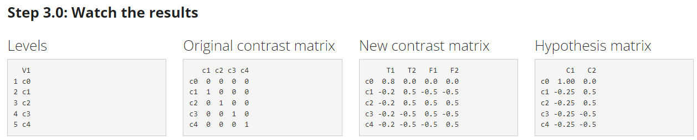

---
output:
  md_document
---

```{r setup, include=FALSE}
knitr::opts_chunk$set(echo = TRUE)
```

# How many contrasts?


In R, the contrast matrix of a specific variable can be observed by using the `contrasts()` function.

Moreover, it is possible to create or assign a contrast matrix to each variable by using the ``contrasts.'' family of functions. The following paragraphs will describe the kind of contrasts that can be generated in R and how can they be interpreted.

## Treatment contrasts


```{r}
contr.treatment(3)
```


Assumed $n$ levels of a categorical variable, in case of treatment contrasts (or dummy coding), the aim is to compare $n-1$ levels to a level chosen as reference or baseline. 

In R, the contrast matrix for treatment contrasts is `contr.treatment()`, setting as argument the number of levels of the variable of interest. In this case, $n = 4$.

NB: in R, the reference level is automatically assigned to the first level in alphabetical order. In case of levels coded with alphanumerical string, the reference will be the one containing the lowest number.


In this case, the first row contains the reference level.

$\textbf{Real-life example}$: Suppose we have two experimental conditions and we want to compare each of them to a control/placebo condition. Treatment contrasts can be very useful!

## Simple contrasts


```{r,echo=FALSE}
nLevels=3
dummy <- contr.treatment(nLevels)
dimnames(dummy) <- NULL
coding <- matrix(rep(1/nLevels, prod(dim(dummy))), ncol=nLevels-1)
s_cod <- round((dummy - coding),2)
s_cod
```


A commonly used contrast coding scheme is the centered treatment coding, also known as the ``Simple'' contrasts. 

The centered treatment coding scheme involves centering the variable at $1/n$.

More in general, centering involves subtracting the mean value of each contrast (within the contrast matrix) from each element within that contrast. 

The purpose of centering is to shift the contrasts so that they are referenced to a meaningful baseline, typically the grand mean or the overall average. Centering allows to better interpret the effects represented by the contrasts and helps in comparing the effects relative to the baseline.

$\textbf{Real-life example}$: Suppose we have, again, two experimental conditions and we want to compare each of them to a control/placebo condition. Suppose now that in the model there are some centered covariates. Simple contrasts can be very useful!

## Sum contrasts

```{r}
contr.sum(3)
```


In sum (or deviation) contrasts, the aim is to compare the $n-1$ levels with the grand mean of those levels. 

In R, the overall mean will be assigned always to the last level in alphabetical order, coded as $\textbf{-1}$. In case of levels coded with alphanumerical string, the reference will be the one containing the highest number. The level to be compared is coded with $\textbf{1}$ and the others with $\textbf{0}$. In R, the contrast matrix for sum contrasts is `contr.sum()`, setting as argument the number of levels of the variable of interest.

In this case, the last row contains the level use to encode and represent the grand mean.


$\textbf{Real-life example}$: Suppose we want to compare the incomes of specific workers with the income of the overall workers of a country. Sum contrasts can be very useful, since one level can represent the grand mean of the population!

## Scaled sum contrasts

```{r}
contr.sum(3)/3
```

In scaled sum contrasts, the aim is similar to sum contrast. The difference is that in the case of scaled sum contrasts, contrasts weights are scaled over the number of levels of the variable itself. In R, the contrast matrix for scaled sum contrasts is `contr.sum()`, setting as argument the number of levels of the variable of interest and dividing the function by the same number.

Formal note: Dividing a contrast by the number of factor level is an operation also called $\textbf{normalization of the contrasts}$. It is a form of standardization of the contrasts.

Normalizing is an advantageous choices especially when coding a priori hypothesis on interactions, and/or in case there are other (scaled) covariates in the model. 

It is possible to normalize all the types of contrasts in R. With appRiori, the Customized contrasts are normalized by default!


$\textbf{Real-life example}$: Suppose we have, again, the previous groups of workers. Suppose now that in the model there are some normalized covariates (i.e., the age of each worker). Scaled sum contrasts can be very useful!

## Repeated contrasts


```{r}
MASS::contr.sdif(3)
```


In repeated contrasts (known also as successive difference contrasts or sliding difference contrasts or simple difference contrasts), the aim is to compare the neighbor levels of a variable. For instance, if we have a variable with three levels, the contrasts will be: $\textbf{2 vs 1}$, $\textbf{3 vs 2}$. 

For each comparison, the first element will be coded with a negative value, and the other(s) with a positive one. In R, the contrast matrix for repeated contrasts is `contr.sdiff()` of the ``MASS` package, setting as argument the number of levels of the variable of interest.

$\textbf{Real-life example}$: Suppose we want to compare the level of noise detected among three adjacent urban areas of a city. In particular, we want to compare each urban area with its adjacent one. In this case, repeated contrasts are very useful!

## Polynomial contrasts

```{r}
contr.poly(3)
```


Polynomial contrasts (or orthogonal polynomial contrasts) are useful to test possible trends of the variable’s levels (i.e., linear, quadratic, cubic etc.). In R, the contrast matrix for polynomial contrasts is `contr.poly()`, setting as argument the number of levels of the variable of interest.

In the case at hand, the first contrast refers to a linear trend. The second contrast represents a quadratic trend.


$\textbf{Real-life example}$: Suppose we want to compare the attention skills of three age cluster: Children, Adolescents and Adults. We are interested in understanding if the attention skills can follow a linear trend or a U-shape trend. Polynomial contrasts can be very useful!

## Helmert contrasts

```{r}
contr.helmert(3)
```


Helmert contrasts are very useful for variables with $n>2$. 

Assuming $n=3$, the first contrast will encode the difference between the first two levels. The second contrast will encode the difference between the third level to the average of the first two conditions. 

In R, the contrast matrix for helmert contrasts is `contr.helmert()`, setting as argument the number of levels of the variable of interest.

$\textbf{Real-life example}$: Let's consider again the previous three age clusters. Now we are interested in understanding if the attention skills can be different between Children and Adolescents. Finally we want to understand if the attention skills of the non-Adults (i.e., Children and Adolescents taken together) can be different to the adults' attention skills. Helmert contrasts can be very useful!

# What's new in appRiori?

With appRiori, it is possible to use also further types of contrasts:

* Reverse helmert contrasts
* Customized contrasts: Set your customized contrasts by using a drag-and-drop menu.


## Reverse helmert contrasts

```{r,echo=FALSE}
tmp0=contr.helmert(3)
tmp0.1=apply(tmp0,2,rev)
tmp0.2=tmp0.1[,ncol(tmp0.1):1]
rownames(tmp0.2)=NULL
tmp0.2
```


These contrasts consist in the reversed version of the Helmert contrasts. The can be very useful for variables with $n>2$.

Assuming $n=3$, the first contrast will encode the difference between the first level with the average of the last two conditions. The second contrast will encode the difference between the last two levels.

$\textbf{Real-life example}$: Suppose to have three soccer teams, A, B and C. Suppose we want to compare the average won competitions of each team, compared to the all the other successive team, taken together. Assuming to start with the team A, we want to compare A __vs__ B and C taken together. Finally we want to compare B __vs__ C won competitions. Reverse helmert contrasts can be very useful!

## Customized contrasts

In appRiori, you contrast by using a dran-and-drop menu. 

Suppose, for instance, that we have a variable called "C", composed by five categories (i.e., c0, c1, c2, c3, c4). Assume now that c0 corresponds to a neutral condition. We could be interested in planning __a priori__ two comparisons:

* The condition c0 against (the average of) all the others taken together (i.e., c0 $\textit{vs}$ (c1+c2+c3+c4))
* Excluding c0, the (average of) former two conditions with the (average of) latter two (i.e., (c1+c2) $\textit{vs}$ (c3+c4))

This can be done in appRiori following these steps:

1. Select the variable from the dropdown menu in the top-left corner of the Panel ("C" variable in this example).
2. Select "Customized" from the "Select contrast type" menu.
3. Select the number of contrasts to set from the "How many contrasts do you want to set?" menu ($\textbf{2}$ in this example)

<center>

</center>

4. Based on the decision made on point 3, a number of drag-and-drop menus will appear. In this case, two.
5. Drag the first condition(s) from the first block to the second one. Then, drag the other condition(s) from the first block to the third one. If you are not interested in one or more conditions, leave them within the first block.
6. Repeat this procedure for all the drag-and-drop menus.

After the last comparison has been set, it is possible to observe the default contrast matrix made by R, the new contrast matrix and the corresponding hypothesis matrix. In our example:

<center>

</center>


Examining the new contrast matrix, it is possible to observe that some contrasts are labelled with a __T__ letter, while other contrasts are labelled with a __F__ letter. 

Why this?

AppRiori is programmed to define two groups of contrasts:


1. **Target contrasts**, namely the ones we want to test (in our example, two)
2.  **Filler contrasts**, namely orthogonal and completely random contrasts that are created to complete the n-1 contrasts matrix. In this way the statistical model (that would be defined later) can consume the necessary degrees of freedom ($n-1$) that should be expected from the model itself (Cohen, 1968).

 
The code corresponding to this procedure is.

<center>

</center>

Up to now, appRiori is programmed to set contrast based on default contrasts and the drag and drop menu. 

This logic can be also applied for more than one variable, as in case of interactions!

For other fancy ways to customize the..stay tuned!!

In the next panels, two examples are provided, aimed at explaining how to (1) plan the contrasts, (2) use them into a regression model and (3) interpret the results!

## References

Cohen, J. (1968). Multiple regression as a general data-analytic system. Psychological Bulletin, 70 (6p1), 426.
