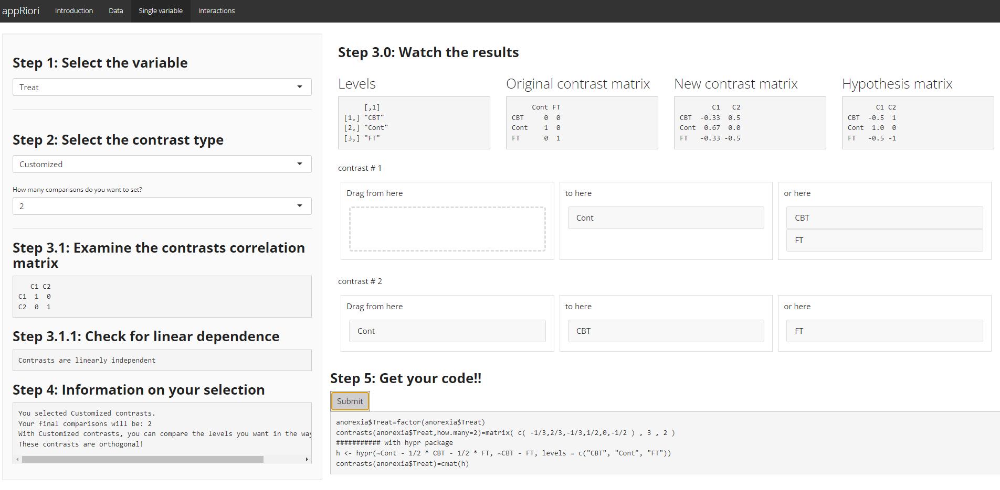

# An example with a single variable 


Let's see how appRiori works in practice.
For this example, we will use the database `anorexia` from the `MASS` package. This database, contains data referring to the weight change data of young female anorexia patients (see `?MASS::anorexia` for further information). 

This database contains a categorical variable named $\textit{Treat}$, composed of three levels: "Cont" (control), "CBT" (Cognitive Behavioral Treatment) and "FT" (Family Treatment).

For practical purposes, let's download the data from R. In this way, we will be able to upload it in appRiori.


```r
anorexia=MASS::anorexia #or data("anorexia") if MASS is open in your R/ Rstudio console

write.table(anorexia,"anorexia.csv",sep = ";",dec = ".",row.names = F,col.names = T)
```


Suppose now that a researcher is interested in understanding if the weight of the patients is the same before the study period. In particular, the researcher is interested in testing the following hypotheses:

1. The weight of patients assigned to control group is not different, on average, than the weight of the patients assigned to the other two groups (i.e., receiving a CBT or FT).
2. The weight of patients assigned to CBT group is not different, on average, than the weight of the patients assigned to the FT group.

These hypotheses can be investigated through Customized contrasts!

The following picture displays how to set and obtain the code corresponding to this case:

<center>

</center>


**Step 1**: Since the Reverse Helmert contrasts cannot be used (the default reference level is CBT and not Cont), we can select the Customized option from the second drop-down menu.

**Step 2**: Since the hypotheses are two, we set to 2 the number of contrasts (that coincide with the maximum number of contrasts that can be set with our variable..remember the golden rule!).

**Step 3**: For the first comparison, we drag the 'Cont' level in the middle box, while the other two in the right box. 

**Step 4**: For the second comparison, we drag the 'CBT' level to the middle box, while the 'FT' level in the right box.

**Step 5**: At that point, we ca see the default, new and hypotheses matrices related to our comparisons.

**Step 6**: Let's get our code.

**Step 7**: Once we have the code, we can test the hypotheses through a linear regression.


```r
anorexia$Treat=factor(anorexia$Treat)
contrasts(anorexia$Treat,how.many=2)=matrix( c( -1/3,2/3,-1/3,1/2,0,-1/2 ) , 3 , 2 )
########### with hypr package
# library(hypr)
# h <- hypr( Cont ~ (CBT + FT)/2,CBT ~ FT )
# contrasts(anorexia$Treat)=cmat(h)

summary(lm(Prewt~Treat,data=anorexia))
```

```
## 
## Call:
## lm(formula = Prewt ~ Treat, data = anorexia)
## 
## Residuals:
##      Min       1Q   Median       3Q      Max 
## -12.6897  -3.0317  -0.4936   3.6593  12.2103 
## 
## Coefficients:
##             Estimate Std. Error t value Pr(>|t|)    
## (Intercept)  82.4923     0.6306 130.807   <2e-16 ***
## Treat1       -1.4018     1.2955  -1.082    0.283    
## Treat2       -0.5398     1.5920  -0.339    0.736    
## ---
## Signif. codes:  0 '***' 0.001 '**' 0.01 '*' 0.05 '.' 0.1 ' ' 1
## 
## Residual standard error: 5.212 on 69 degrees of freedom
## Multiple R-squared:  0.01708,	Adjusted R-squared:  -0.01141 
## F-statistic: 0.5995 on 2 and 69 DF,  p-value: 0.5519
```


### Interpretation

What is the summary telling us? Let's have a look at the Coefficients' table:

1. The row referring to **Treat1** contains the result about the first hypothesis. In particular, we can see that, on average, the difference in lbs, before the study, between the weight of participants assigned to the control group and the average weight of participants assigned to the other groups taken together is equal to $-1.40$. This difference is not statistically significant ($p = .28$, last column of the table). So, the researcher should reject the null hypothesis, meaning that her/his/their idea was corroborated by the analysis!

2. The row referring to **Treat2** contains the result about the second hypothesis. In particular, we can see that, on average, the difference in lbs, before the study, between the weight of participants assigned to the CBT group and the weight of participants assigned to the FT group is equal to $-0.54$. This difference is not statistically significant ($p = .74$, last column of the table). So, the researcher should reject the null hypothesis, meaning that his/her/their idea was corroborated by the analysis!

Good job, researcher!

But, how can be interpreted the summary table in case of interactions and planned contrasts?

The next and last panel will provide an example of this scenario!
