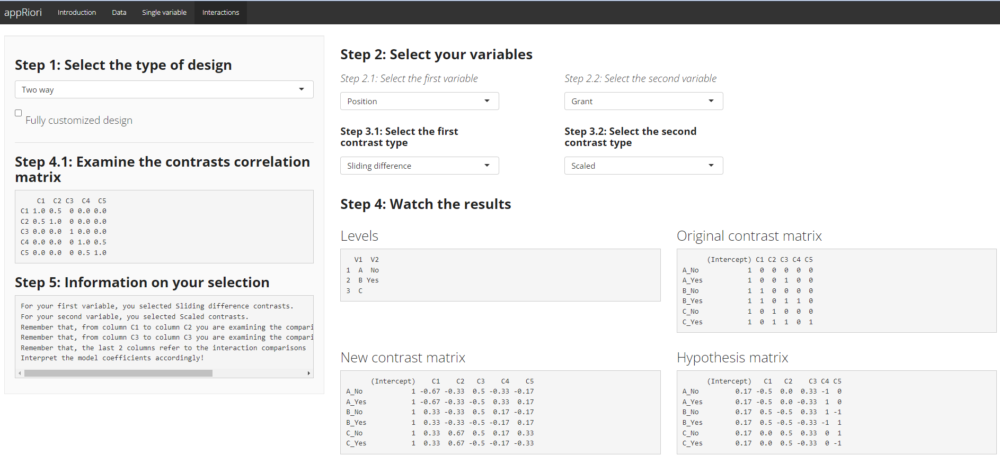

---
output:
  md_document
---

```{r setup, include=FALSE}
knitr::opts_chunk$set(echo = TRUE)
airquality$day_bin=ifelse(airquality$Day<16,"First_half","Second_half")
airquality$Month_ch=c(rep("m5_May",31),rep("m6_June",30),rep("m7_July",31),rep("m8_August",31),rep("m9_September",30))
write.table(airquality,"airquality.csv",sep = ";",dec = ".",row.names = F,col.names = T)
```

# An example with with a two-way interaction 


For this example, we will use the database `airquality`. This database, contains data referring to daily air quality measurements in New York, from May to September 1973. (see `?airquality` for further information). 

In our example we will consider the following variables:

* **Temp**, a numerical variable referring to Temperature in Fahrenheit.
* **Month**, a numerical variable ranging from 1 to 12, where 1 encodes January and 12 encodes December.
* **Day**, a numerical variable encoding the days of each month.

Suppose now that a researcher is interested in understanding if, in a time not afflicted by climate change, the temperature would change according to the following hypotheses:

1. The mean temperature (in F), of May should be lower than the mean temperature of June. Similarly, the mean temperature, of June should be lower than the mean temperature of July. No differences should be observed between the mean temperature of July and August. Finally, The mean temperature of August should be higher than the mean temperature of September. 
2. This set of comparisons should be better detected considering the temperature change that occurs between the first half (that should be warmer) of the Month and the second half.

Let's see how to set these planned contrasts with appRiori!

For practical purposes, let's create a categorical variable that splits each month into two parts. Moreover, let's create another variable explicitly stating the name of the month. Then, we can download the data frame in order to use it inside appRiori.

```{r,eval=FALSE}

airquality$day_bin=ifelse(airquality$Day<16,"First_half","Second_half")
airquality$Month_ch=c(rep("m5_May",31),rep("m6_June",30),rep("m7_July",31),rep("m8_August",31),rep("m9_September",30))
write.table(airquality,"airquality.csv",sep = ";",dec = ".",row.names = F,col.names = T)
```


The following picture displays how to set and obtain the code corresponding to this example:

<center>

</center>


**Step 1**: After upolading the data and selected the "Interactions" Panel, we should select `Two way` from the first menu.

**Step 2**: We select the **Month** as the first variable and **day_bin** as second.

**Step 3**: Then we select the appropriate contrasts for each variable. **Sliding difference** for the first variable and **scaled** for the second (see the __Type of contrasts__ section for further explanation of how such contrasts work).

**Step 4**: At that point, we ca see the default, new and hypotheses matrices related to our comparisons. Inside the New contrast matrix, we can see that the column 1,2,3,4 encodes the contrasts for the first main effect (i.e., Month). Columns 5 encodes the contrasts for the second main effect (i.e., day_bin). The last four columns encode the contrasts for interaction.

**Step 4.1**: We can check the correlations among our contrasts.

**Step 5**: A final look at what we selected (just to be sure).

**Step 6**: Let's obtain our code.

**The end**: Once we have the code, we can test the hypotheses through a linear regression (for practical purposes, let's assume the response variable called `Temp` as normally distributed).


```{r}
airquality$Month_ch=factor(airquality$Month_ch)
airquality$day_bin=factor(airquality$day_bin)
contrasts(airquality$Month_ch)=MASS::contr.sdif(5)
contrasts(airquality$day_bin)=contr.sum(2)/2
########### with hypr package
# h_Month_ch<- hypr()
# cmat(h_Month_ch)<-MASS::contr.sdif(5)
# contrasts(airquality$Month_ch)=cmat(h_Month_ch)
# h_day_bin<- hypr()
# cmat(h_day_bin)<-contr.sum(2)/2
# contrasts(airquality$day_bin)=cmat(h_day_bin)

summary(lm(Temp~Month_ch*day_bin,data=airquality))

```


### Interpretation

What is the summary telling us? Let's have a look at the Coefficients' table:

1. The row referring to **Month2-1** contains the comparisons between the mean temperature of June compared to the mean temperature of May. Such difference is equal to $13.54$ and it is statistically significant ($p < .001$).

2. The row referring to **Month3-2** contains the comparisons between the mean temperature of July compared to the mean temperature of June. Such difference is equal to $4.82$ and it is statistically significant ($p <.01$). 

3. The row referring to **Month4-3** contains the comparisons between the mean temperature of August compared to the mean temperature of July. Such difference is equal to $0.08$ and it is not statistically significant ($p = .96$). 

4. The row referring to **Month5-4** contains the comparisons between the mean temperature of September compared to the mean temperature of August. Such difference is equal to $-7.10$ and it is statistically significant ($p < .001$). 

5. The row referring to **day_bin1** contains the comparisons between the mean temperature observed in the first half of the month compared to the mean temperature observed in the second half of the month. Such difference is equal to $3.97$ and it is statistically significant ($p < .01$). 

6. Now we can start with the interaction effect. The row referring to **Month2-1:day_bin1** contains the comparisons between the mean temperature of June compared to the mean temperature of May, across the two halves of the month. In other words, the difference of the difference of mean temperatures between the two halves of the month of June and those of May. Such a difference is equal to $6.64$ and it is statistically significant ($p = .04$).

7. The row referring to **Month3-2:day_bin1** contains the comparisons between the mean temperature of July compared to the mean temperature of June, across the two halves of the month. In other words, the difference of the difference of mean temperatures between the two halves of the month of July and those of June Such a difference is equal to $-5.78$ and it is not statistically significant ($p = .07$).

8. The row referring to **Month4-3:day_bin1** contains the comparisons between the mean temperature of August compared to the mean temperature of July, across the two halves of the month. In other words, the difference of the difference of mean temperatures between the two halves of the month of August and those of July Such a difference is equal to $0.91$ and it is not statistically significant ($p = .77$).

9. The row referring to **Month5-4:day_bin1** contains the comparisons between the mean temperature of September compared to the mean temperature of August, across the two halves of the month. In other words, the difference of the difference of mean temperatures between the two halves of the month of September and those of August Such a difference is equal to $7$ and it is statistically significant ($p = .03$).

It seems that, even in this case, the hypotheses of the researcher are corroborated by the data!


Good job, researcher!

This is the last part of the tutorial.

Now is the moment to start using appRiori!
