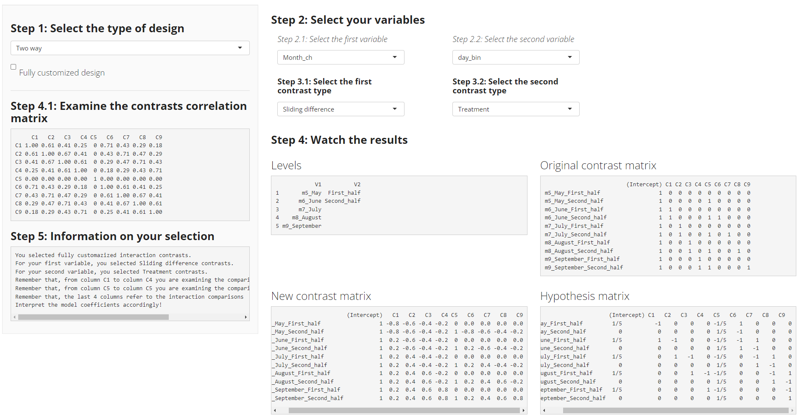

# An example with a two-way interaction

For this example, we will use the `stress` database. It is contained in
the `appRiori` package. This database, contains data referring to the
level of stress perceived from 102 academics. NB: This data are
fictional. (see `?stress` for further information).

In our example we will consider the following variables:

-   **Stress**, a numerical variable referring to the level of stress
    perceived at the moment of the assessment. It represents a score
    ranging from 0 (no stress) to 100 (maximum level of stress).
-   **Position**, a categorical variable with three levels, referring
    to (A) PhD student, (B) Full-Time Researchers and (C) Professors
    (Associate or Full).
-   **Grant**, a categorical variable describing if the individual is
    applying for a grant (YES), or not (NO).

Suppose now that a researcher is interested in understanding if the
level of stress would change according to the following hypotheses:

1.  The average level of stress of PhD students should be lower than the
    average level of stress of FT-Researchers. Finally, average level of
    stress of FT-Researchers should be lower than average level of
    stress of Professors.
2.  This set of comparisons should be better detected considering the
    fact an individual is applying for a grant or not.

Let’s see how to set these planned contrasts with appRiori!

**Step 1**: After upolading the data and selected the “Interactions”
Panel, we should select `Two way` from the first menu.

**Step 2**: We select the **Position** as the first variable and
**Grant** as second.

**Step 3**: Then we select the appropriate contrasts for each variable.
**Sliding difference** for the first variable and **Scaled** for the
second (see the **Type of contrasts** section for further explanation of
how such contrasts work).

**Step 4**: At that point, we ca see the default, new and hypotheses
matrices related to our comparisons. Inside the New contrast matrix, we
can see that the column 1,2 encodes the contrasts for the first main
effect (i.e., Position). Columns 3 encodes the contrasts for the second
main effect (i.e., Grant). The last two columns encode the contrasts for
interaction.

**Step 4.1**: We can check the correlations among our contrasts.

**Step 5**: A final look at what we selected (just to be sure).

**Step 6**: Let’s obtain our Basic R code.

The following picture displays how to set and obtain the code
corresponding to this example:

**The end**: Once we have the code, we can test the hypotheses through a
linear regression.

    Stress$Position=factor(Stress$Position)
    Stress$Grant=factor(Stress$Grant)
    contrasts(Stress$Position)=MASS::contr.sdif(3)
    contrasts(Stress$Grant)=contr.sum(2)/2

    summary(lm(Stress~Position*Grant,data=Stress))

    ## 
    ## Call:
    ## lm(formula = Stress ~ Position * Grant, data = Stress)
    ## 
    ## Residuals:
    ##     Min      1Q  Median      3Q     Max 
    ## -9.0929 -2.2796 -0.1859  2.6179  7.7371 
    ## 
    ## Coefficients:
    ##                    Estimate Std. Error t value Pr(>|t|)    
    ## (Intercept)         79.8214     0.3673 217.329   <2e-16 ***
    ## Position2-1         -1.3309     0.8997  -1.479   0.1423    
    ## Position3-2          1.5241     0.8997   1.694   0.0935 .  
    ## Grant1              -0.9067     0.7346  -1.234   0.2201    
    ## Position2-1:Grant1  -0.3971     1.7993  -0.221   0.8258    
    ## Position3-2:Grant1   0.9400     1.7993   0.522   0.6026    
    ## ---
    ## Signif. codes:  0 '***' 0.001 '**' 0.01 '*' 0.05 '.' 0.1 ' ' 1
    ## 
    ## Residual standard error: 3.709 on 96 degrees of freedom
    ## Multiple R-squared:  0.0514, Adjusted R-squared:  0.001992 
    ## F-statistic:  1.04 on 5 and 96 DF,  p-value: 0.3986

### Interpretation

What is the summary telling us? Let’s have a look at the Coefficients’
table:

1.  The row referring to **(Intercept)** contains the estimated average
    values of stress of all the sample. It is quite high!

2.  The row referring to **Position2-1** contains the comparisons
    between the mean stress of Full-Time researchers (i.e., group B)
    compared to the mean temperature of PhD students (i.e., group A).
    Such difference is equal to  − 1.33 and it is not statistically
    significant (*p* = .14).

3.  The row referring to **Position3-2** contains the comparisons
    between the mean stress of Professors (i.e., group C) compared to
    the mean stress of Full-Time researchers (i.e., group B). Such
    difference is equal to 1.52 and it is not statistically significant
    (*p* = .09).

4.  The row referring to **Grant** contains the comparisons between the
    mean stress observed in those who are not applying for a grant
    compared to those who are applying for a grant. Such difference is
    equal to  − 0.91 and it is not statistically significant
    (*p* = .22).

5.  Now we can start with the interaction effect. The row referring to
    **Position2-1:Grant1** contains the comparisons between the mean
    stress of Full-Time researchers (i.e., group B) compared to the mean
    temperature of PhD students (i.e., group A), across those who are
    not applying for a grant compared to those who are applying for a
    grant. Such a difference is equal to  − 0.40 and it is not
    statistically significant (*p* = .83).

6.  The row referring to **Position3-2:Grant1** contains the comparisons
    between the mean stress of Professors (i.e., group C) compared to
    the mean stress of Full-Time researchers (i.e., group B), across
    those who are not applying for a grant compared to those who are
    applying for a grant. Such a difference is equal to 0.94 and it is
    not statistically significant (*p* = .60).

It seems that:

**If you work in academics, you are stressed.**

**Regardless of the position you have, or whether you are applying for a
grant (or not).**

Good job, researcher!

This is the last part of the tutorial.

Now is the moment to start using appRiori!
