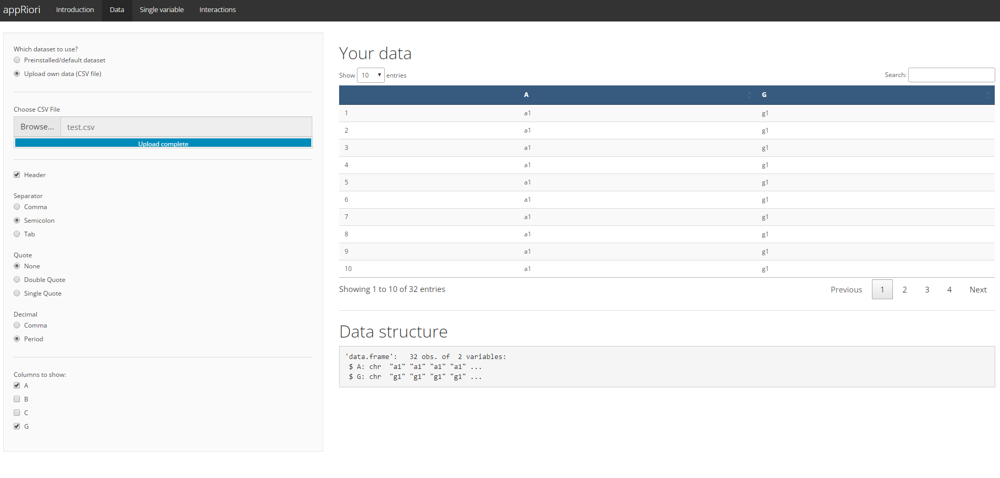
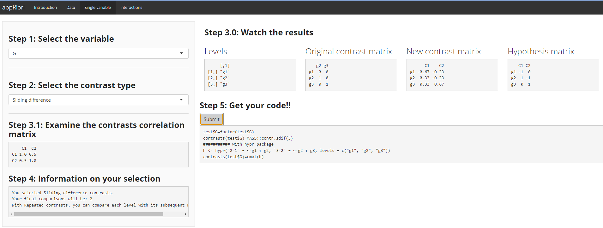
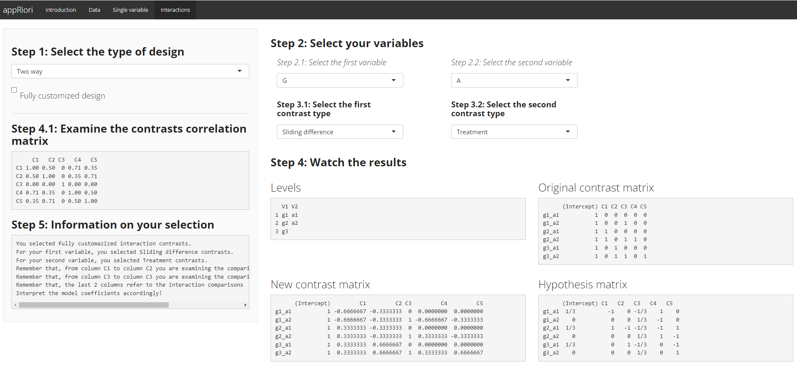

How appRiori works
===================

Data Uploading
--------------

As a first step, it is required to upload our data. 

The second Panel of appRiori, called "Data", allows to upload data. It is possible to upload:

* All the default databases contained inside the R packages.

* Raw databases contained in our computers.

As for the `read.table()` function of R, it is possible to set the type of field separator, decimal and quote. Furthermore, it is possible to set the first row as header or not.

&nbsp;

&nbsp;

Once the data have been uploaded, appRiori displays them as a data table. It is possible to select the number of rows displayed and to search specific values, through the search bar.

Moreover, it is possible to selected the variables to be shown by checking the corresponding box within the "Column to show" list.

Finally, the data structure is provided at the bottom of the Panel.

In this example, a file called $\textit{test.csv}$ has been uploaded, and the columns "A" and "G" have been selected. Both of them contain character values, as suggested by the output.

Plan contrasts for single variables
-----------------------------------

Once data have been uploaded, it is time to explore what appRiori can do!

The first option is to plan contrasts for single variables, by clicking on the "Single variable" button.

The left side of the Panel contains two dropdown menu:

* The first menu allows to select one among the categorical variables of the uploaded data frame. Note that appRiori permits to select only variables that are "character" or "factor".

* The second menu allows to select the type of contrast. It is possible to select either standard or customized contrasts. See the "Type of contrasts" Panel to discover which and how many contrasts can be set with appRiori.

&nbsp;

&nbsp;

Suppose that we select the variable called "G". It is a categorical variable with three levels (i.e., g1, g2, and g3).

Suppose now that, in a future and hypothetical model, we are interested in comparing the mean of condition __g1__ with the mean of condition __g2__. Moreover, we want to compare the mean of condition __g2__ with the mean of condition __g3__. These comparisons, in contrasts language, correspond to the so called sliding difference contrasts (often known also as repeated contrasts or successive difference contrasts or simple difference contrasts). 

Therefore, we select the "G" variable form th first menu and the "Sliding difference" option from the second menu.

At this point, appRiori displays the following blocks:

* Levels: this block shows the original categories belonging to the selected variables.

* Original contrast matrix: the contrast matrix produced by default in R, after converting the selected variable into factor. It corresponds to `contrasts(factor(test$G))` command.

* New contrast matrix: the contrast matrix corresponding to the hypothesis we have. It corresponds to `contrasts(factor(test$G))=MASS:sdif(3)` command.

* Hypothesis matrix: it is a contrast matrix where each column codes one condition/group/level and each row codes one hypothesis. Note that Each hypothesis is a set of weights depicting how different condition/group/level means are compared (Schad et al., 2020).

* A correlation matrix displaying the relationship among the new contrasts. 

* A summary of our selection, containing which kind of contrasts have been selected, how do they work and how many comparisons are admissible/selected (in case of customized contrasts).

(If) We are satisfied by the new contrast matrix, so we want to apply it to our data. To do this, we need for the corresponding code in R.

Such a code is available in the "Get your code" section, in the bottom of the Panel.

We need to simply click on the submit button, and will obtain a snippet of code performing:

* The conversion of our variable from a character into a factor. By default, appRiori is programmed to convert the target variable into a factor.

* The assignment of the desired contrast matrix to the original one.

* If you are a (beginner) user or a fan of the `hypr` package (Rabe et al., 2020), the same operation coded by the previous two lines according to this package. Briefly, an empty `hypr` object called $h$ is created; then the new contrast matrix is assigned to the `cmat()` function. Finally, the result of this latter code is assigned to the `contrasts()` function referred to our target variable.

Plan contrasts for interactions
-------------------------------

The procedure applied to single variables, can be implemented also in case of interactions.

Currently, appRiori allows the user to plan contrast in case of two ad three-way interactions.

It is possible to set and visualize the contrasts matrix referred to this hypothesis in the "Interaction" Panel.

The procedure is identical to the one used for the single variable. The differences can be found in the outputs' windows.

Suppose, for instance, that we want to understand if the planned contrasts set for the variable G (in the previous example) can vary across another variable. Let's assume A (from the same data frame) as this second variable.

As a first step, we select from the menu located on upper left of the page the option "Two way". 

Then, we select the G variable in the first dropdown menu. We select also the sliding difference contrast in the corresponding dropdown menu (located under the one aimed at selecting the related variable). We do the same for the second variable, but selecting treatment contrasts.

The outputs will be displayed as follows:

&nbsp;

&nbsp;
 

* Levels: we can see two column vectors, displaying the levels of both variable (i.e., __g1__, __g2__ and __g3__ for variable G and __a1__ and __a2__ for variable A).

* Original contrast matrix: the contrast matrix (produced by default from R) codes both variable as treatment contrasts. The second and the third columns code the contrasts for variable G. The fourth column codes the contrasts for variable A. The last two columns code the interaction, by multiplying the columns encoding of the contrasts of G by the column encoding of the contrast of A (Remember the golden rules of contrasts coding!!). 
* New contrast matrix: the same logic is applied for this matrix, with the contrasts selected __a priori__.
* Hypothesis matrix: as for the new contrast matrix, we can observe how to code our hypothesis. Note that the header of this matrix (as the rows' names of the new contrast matrix), is composed by the interaction among levels of both variables (i.e., $3 \times 2$). To be coherent with the new contrast matrix, even the hypothesis matrix is transposed.

Plan your customized contrasts
------------------------------

The problem: what if we have hypotheses that cannot be tested through the standard contrasts provided by R?

The solution: appRiori is programmed to plan customized contrasts and to provide the corresponding easy-to-use code. In the next panel, a possible way to customize contrasts is described, after the default contrasts.
